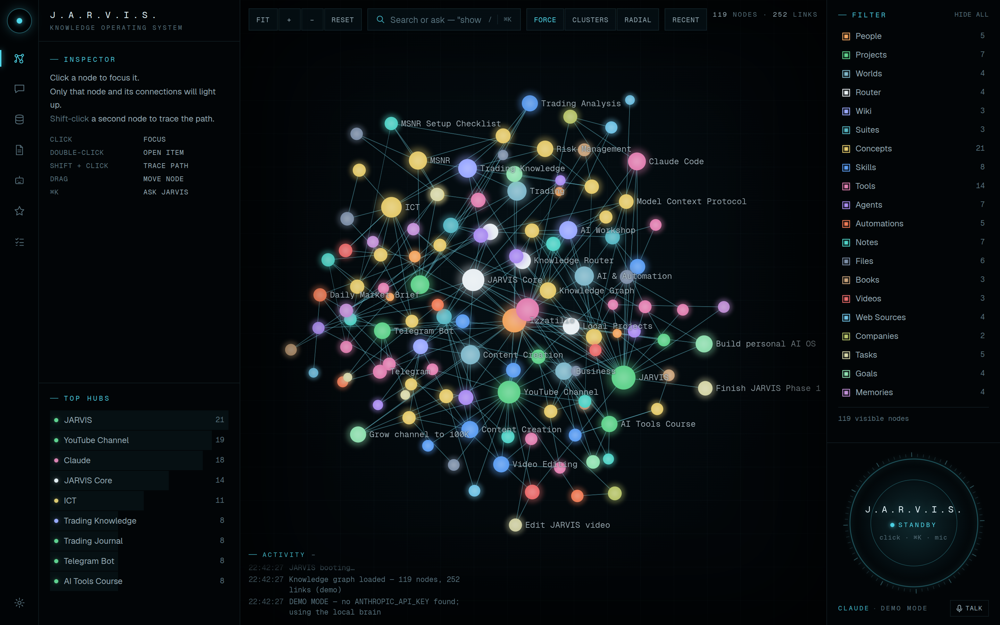

# J.A.R.V.I.S. — personal AI knowledge OS

A black, graph-centred command centre: your projects, knowledge, files, tools and agents as one interactive knowledge graph, with JARVIS (Claude, from Phase 2) as the brain.



## Launch

Requirements: **Node.js 20 or newer** (check with `node -v`).

```bash
cd jarvis
npm install        # first time only
npm run dev        # then open http://localhost:3000
```

No API keys are needed. Without keys JARVIS runs in **DEMO MODE** with a local brain that searches the knowledge graph.

### Talk to JARVIS by voice: say "Jarvis"

1. Open JARVIS in Google Chrome and press **Voice · Off** under the HUD so it says **Voice · On**. Allow the microphone.
2. The HUD shows **SAY "JARVIS"**. Say "Jarvis", wait for "Labbay?", then your question ("bugungi ishlarimni ayt", "show everything connected to ICT"). Or say it in one breath: "Jarvis, ICT bilan bog'liq fayllarni top".
3. JARVIS answers in chat and aloud, then listens ~10 s for a follow-up without "Jarvis", then waits for "Jarvis" again. "Bekor qil" / "cancel" cancels; Esc or the Stop button interrupts.

No paid service is needed (Chrome's recogniser and voices). A Gemini key adds a natural Uzbek voice. Click the HUD or press ⌘⇧Space to talk without the wake word. All switches are in **Settings → Ovoz**. Details and the plan for a background macOS helper: `docs/VOICE.md`.

### Chat with Claude

1. Create a key at https://console.anthropic.com → API Keys (billing must be set up there).
2. In JARVIS open **Settings → Claude API key**, paste the key and press **Saqlash** (Save). JARVIS checks the key, saves it in `~/.jarvis/keys.env` (only your user can read it) and switches to Claude immediately, no restart needed. (Keys in `.env.local` also work.)
3. The HUD shows "online" and the chat (bottom-right of the graph, or /chat) answers with Claude, using the matching parts of your knowledge graph as context.

The key is read only on the server (`src/ai/claude.ts`, `/api/chat`) and never sent to the browser. `~/.jarvis` is outside the project folder, so updating or reinstalling JARVIS keeps your keys. Optional: `JARVIS_MODEL` picks another Claude model.

**Updating:** when a new version is on GitHub, a **Yangilash** button appears at the top of JARVIS (also in Settings). One click downloads it, keeps your keys, data and settings, installs it and restarts. Start JARVIS with `npm run dev` (it runs `scripts/run.mjs`, which performs the restart).

For a faster production build: `npm run build && npm start`.

## What works now (Phase 1)

| Area | Status |
|---|---|
| Knowledge graph | 119 meaningful demo nodes, 252 typed relationships, WebGL (Sigma.js) with glow, slow float, smooth animations |
| Graph interactions | hover highlights connections · click focuses + dims the rest · double-click opens the item · shift-click traces the path · drag nodes · zoom/pan · Fit · Reset · `/` to search |
| Layouts | Force (ForceAtlas2), Clusters (by category), Radial (around the selected node) |
| Inspector | name, type, description, connections (clickable), importance, last updated, source, tags, metadata, actions |
| Top Hubs | most connected nodes with counts |
| Filter | every category with coloured dot, count and toggle, instant |
| Search / Ask | natural language: "Find everything related to YouTube", "Show all projects connected to Claude", "Find files related to ICT", "How are Claude and my YouTube project connected?", "What am I working on?" |
| Command palette | `⌘K` / `Ctrl+K` or click the HUD: Ask Jarvis, Search Memory, Search Files, Add Note, Create Task, Import File, navigation, voice replies |
| Memory (permanent) | Memories, tasks and notes are saved in `~/.jarvis/jarvis-store.json` on this computer and survive reloads, restarts and updates. Saved items can be marked done or deleted from the Inspector |
| AI actions | With a Claude or Gemini key, JARVIS uses tools: searches the graph, opens items, traces connections, highlights results, lists tasks, saves memories/tasks/notes and marks tasks done ("…ni eslab qol", "vazifa qo'sh: …", "vazifalarim qanday?"). Tools run on the server, are logged, and cannot delete anything or reach outside this computer |
| Computer control (Mac) | "Telegramni och", "YouTube'da ICT darsini qidir", "BTC grafigini och", "ovozni 30 qil", "ekranni rasmga ol". Every action shows a **Ha / Yo'q** card first (in conversation mode JARVIS also asks aloud and listens for "ha"/"yo'q"); no answer in 90 s means no. Only fixed, validated commands (`open -a`, `open <https url>`, `osascript set volume`, `screencapture`), never a shell |
| JARVIS in Telegram | Settings → **JARVIS Telegram'da**: paste the token of a NEW bot made for JARVIS, then send the 6-digit code to it. From then on, text or voice-message JARVIS from the phone (voice is transcribed by Gemini); same tools and memory as the app; computer actions ask **Ha / Yo'q** with Telegram buttons. Only the paired chat is answered. Long polling from this computer, so no public URL is needed (JARVIS must be running) |
| Markets (TradingView) | "BTC narxi qancha?", "oltin grafigini och", "BTC 70000 dan oshsa ayt". Live prices from free public endpoints (Binance for crypto pairs, Yahoo Finance for stocks/forex/gold), TradingView charts opened with approval, price alerts checked every minute and announced in JARVIS and Telegram. Read-only: there is no trading code at all |
| Telegram bots | Settings → **Telegram botlar**: paste a bot token from @BotFather. The bot appears on the graph and JARVIS checks it at start-up and when asked ("botlarim ishlayaptimi?"). Read-only: only `getMe` and `getWebhookInfo` are called (never `getUpdates`, never sends). Tokens stay in `~/.jarvis/telegram.json` (owner-only) and never reach the browser |
| JARVIS HUD + voice | one state (standby, say “Jarvis”, online, listening, transcribing, thinking, searching, executing, approval, speaking, error), each animated from real events; “Jarvis” wake word, follow-up window, cancel, Esc/Stop, ⌘⇧Space; mic level drives the rings; red dot while the microphone is open |
| Chat (real Claude brain) | chat window on the graph page and /chat. For each message the server finds only the relevant memories and graph items, gives them to Claude (Gemini as backup) with the tools, streams the answer, and saves the conversation in `~/.jarvis/conversations.json` (survives reloads, restarts and other browsers; Telegram has its own conversation). Without an AI key the local brain answers |
| Activity stream | real steps from the server (request received, memory/graph search and what was found, AI call, tools, approvals, errors), kept in `~/.jarvis/activity.json` and shown again after a reload; Telegram steps are marked |
| Pages | /graph (main), /chat, /memory, /files, /agents, /skills, /tasks, /settings |
| Scale | `/graph?stress=5000` loads 5,000 extra synthetic nodes for performance testing |

## Checks

```bash
npm test        # unit + API tests (search, retrieval, conversations, activity, /api/chat with a fake Claude)
npm run check   # lint + typecheck + query-engine smoke test + tests + production build
```

## Most important files

| File | What it is |
|---|---|
| `src/components/graph/KnowledgeGraph.tsx` | the Sigma.js renderer: highlighting, focus, paths, drag, animation |
| `src/components/graph/glow-node-program.ts` | WebGL shader that draws the glowing nodes |
| `src/knowledge/demo-graph.ts` | the demo knowledge graph (edit this to change the sample data) |
| `src/knowledge/graph.ts` | graph model, path finding, hubs, layouts |
| `src/knowledge/query.ts` | the offline natural-language query engine (becomes Claude's tools in Phase 2) |
| `src/services/jarvis.ts` | the JARVIS request pipeline (intent → search → act → respond → speak) |
| `src/lib/store.ts` | app state (selection, focus, filters, HUD, activity) |
| `src/components/hud/JarvisHud.tsx` + `src/app/globals.css` | the HUD and the design system |
| `src/app/api/graph`, `src/app/api/status` | server routes (graph data; AI status, never exposes keys) |
| `src/ai/provider.ts` | the server pipeline `runJarvis`: retrieve context → Claude/Gemini with tools → save conversation → activity log |
| `src/ai/prompts.ts`, `src/ai/context.ts`, `src/ai/types.ts` | JARVIS's system prompt (personality, intents), relevant-context retrieval, shared chat types |
| `src/knowledge/graph-search.ts` | keyword search over the graph (English/Uzbek/Russian), used by tools and retrieval |
| `src/server/conversations.ts`, `src/server/activity.ts` | saved conversations and the activity log |
| `src/ai/tools.ts` | the tools the AI can use, and the events they send to the screen |
| `src/server/approvals.ts`, `src/server/computer.ts` | the approval system and the whitelisted Mac actions |
| `src/server/telegram-assistant.ts` | the JARVIS Telegram bot: pairing, polling, voice, approvals |
| `src/server/market.ts` | prices, TradingView chart links, price alerts |
| `src/server/telegram.ts` | connected Telegram bots: token storage, health checks, graph items |
| `src/server/store.ts` | permanent storage for memories, tasks and notes (`~/.jarvis`, set `JARVIS_HOME` to move it) |

See `docs/ARCHITECTURE.md` for how it fits together and the roadmap.
